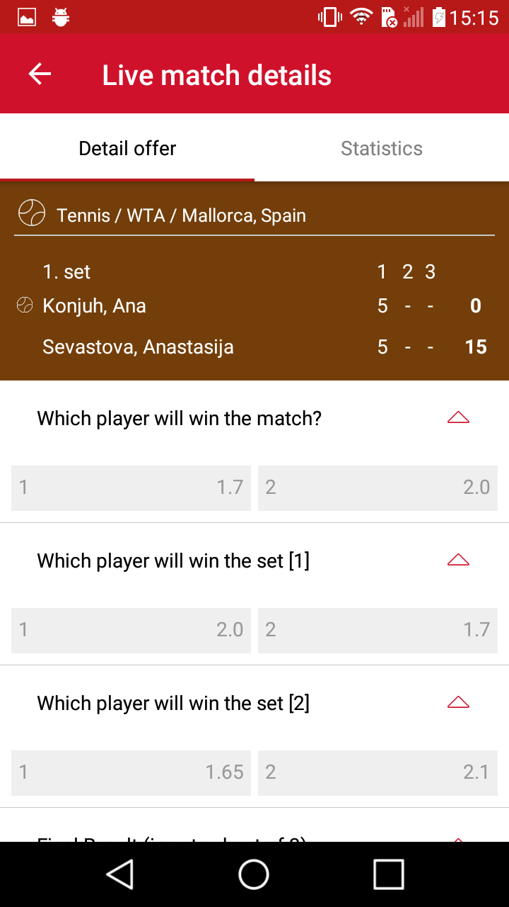

# BetX Android #

BetX Android is a betting application that allows users to place bets on different sports and matches, and to be paid up if they win a ticket. Features like Sport Betting, Live betting, statistic of the matches are interesting for Users of this app.

This application will be available on several markets in the world from South America, West and Central  Europe to East Europe.

Application is in the development phase.

  

  

### Core Technical Concepts ###

SignalR library is used for real time communication with back end. Client and server have a bi-directional communication. Content pushed from server is visible instantly on the client.

For accessing non real time data, rest api is used.

Application is built using Java programming language.

### Notice ###

* Codebase is set for code review process which will be done by [Digital Knights](http://digitalknights.co/) and does not contain all implemented features from origin repository.
* Application build process is using private artifactory repository.
Please contact us if You plan to build application. We will give You credentials for accessing our artifactory. Credentials are stored in a gradle.properties file in a user gradle home directory.

### Todo ###

* Notifications
* Club card
* Ticket control

### Contact ###

* info_ns@zesium.com
