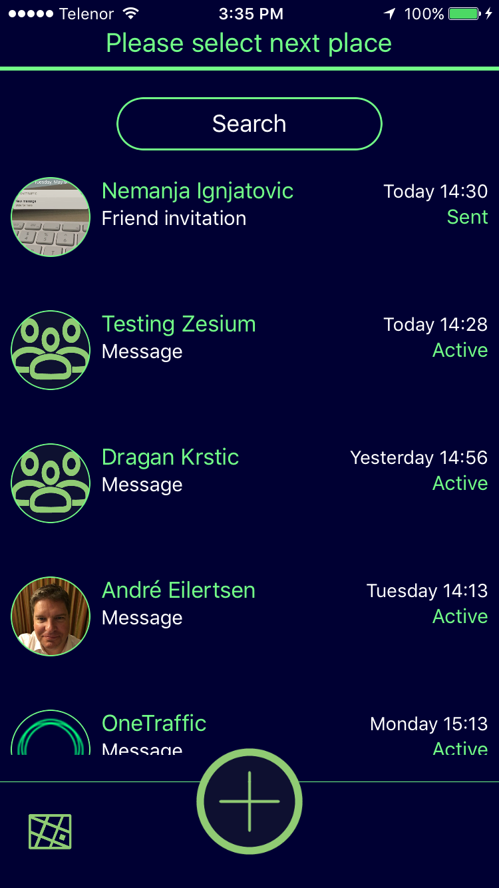

# One Traffic #

One traffic is an application that provides necessary information about all relevant factors on the road. 

It is a mobile communication platform between drivers and important POIs, and allows different users to navigate vehicles to requested places, to see relevant events on the road, and to make ads.

This is a Oslo/San Francisco startup with huge world market potential in the near future.

Application is in the beta testing phase.

### Core Technical Concepts ###

[Mapbox](https://www.mapbox.com/) open source SDK is used for displaying maps with turn-by-turn navigation.

Rest api is used for client-server communication.

Application is built using Objective-C programming language.

   

### Notice ###

* Codebase is set for code review process which will be done by [Digital Knights](http://digitalknights.co/) and does not contain all implemented features from origin repository.
* Code is sample from it's origin repository and can not be compiled.

### Contact ###

* info_ns@zesium.com